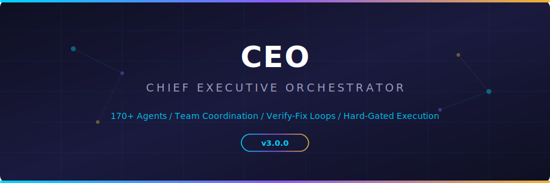
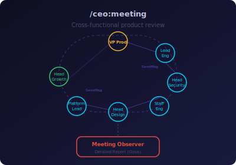
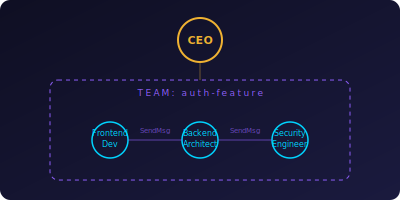
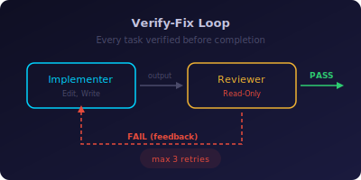
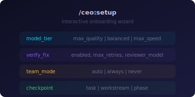

**English** | [简体中文](README_CN.md)

<p align="center">
  
</p>

<p align="center">
  <em>A Claude Code plugin that coordinates 170+ specialized AI agents across 13 domains.<br>Team coordination. Verify-fix loops. Model routing. Hard-gated execution.</em>
</p>

<p align="center">
  
  
  
  
  
</p>

<p align="center">
  <a href="https://andywxy1.github.io/ceo-plugin/">Visit Landing Page</a>
</p>

<p align="center">
  
</p>

## What's New in v3.1.0

<table>
<tr>
<td>

<p align="center">
  
</p>

**Product Meeting** &mdash; `/ceo:meeting` assembles a cross-functional team of agents acting as company staff. They discuss your product freely via `SendMessage` &mdash; proposing bugs, debating improvements, asking each other questions across departments. An independent Meeting Observer then reads the full transcript and writes a comprehensive report with per-person narratives, severity-rated findings, blind-spot analysis, and prioritized action items.

</td>
</tr>
</table>

### Previously in v3.0.0

<table>
<tr>
<td width="50%">

<p align="center">
  
</p>

**Team Coordination** &mdash; Coupled workstreams use `TeamCreate` + `SendMessage` so agents can negotiate laterally (API contracts, shared state) without routing everything through the orchestrator.

</td>
<td width="50%">

<p align="center">
  
</p>

**Verify-Fix Loop** &mdash; Every implementation task is reviewed by a read-only agent (`disallowedTools: Edit, Write`). Failed tasks loop back with specific feedback. Max 3 retries before user escalation.

</td>
</tr>
<tr>
<td width="50%">

<p align="center">
  
</p>

**Onboarding & Settings** &mdash; `/ceo:setup` walks you through model tier, verify-fix preferences, team mode, and checkpoint frequency. Writes `settings.json` so the CEO remembers your choices.

</td>
<td width="50%">

**Model Routing** &mdash; Every agent now has a `model:` field in its frontmatter. Architects, reviewers, and strategists default to Opus. Implementers and developers default to Sonnet. Override globally via `settings.json`:

| Tier | Behavior |
|------|----------|
| `max_quality` | All agents on Opus |
| `balanced` | Opus + Sonnet split (default) |
| `max_speed` | All agents on Sonnet |

</td>
</tr>
<tr>
<td colspan="2">

**Shared Context Protocol** &mdash; Parallel agents read and append to a shared context file (`ceo-projects/<name>/context/<workstream>.md`), preventing duplicate discovery work. [Read the protocol docs &rarr;](docs/shared-context-protocol.md)

</td>
</tr>
</table>

<p align="center">
  
</p>

## What's Inside

- **3 skills** &mdash; `/ceo:ceo` (the meta-orchestrator) + `/ceo:meeting` (product meeting simulation) + `/ceo:setup` (onboarding wizard)
- **170+ specialized agents** spanning 13 domains
- **19 reference docs** &mdash; NEXUS framework, phase playbooks, scenario runbooks, handoff templates, anti-patterns guide
- **Settings system** &mdash; `settings.json` + JSON Schema for full configurability
- **Session-start hook** &mdash; automatically suggests `/ceo` when multi-domain tasks are detected

<p align="center">
  
</p>

## Installation

### Prerequisites

- [Claude Code](https://claude.ai/download) v1.0.33 or later
- Run `claude --version` to check

### Step 1: Add the marketplace

```
/plugin marketplace add andywxy1/ceo-plugin
```

### Step 2: Install the plugin

```
/plugin install ceo@ceo-plugin
```

### Step 3: Run setup (recommended)

```
/ceo:setup
```

This walks you through model tier, verify-fix preferences, team mode, and checkpoint frequency. Takes about 1 minute.

### Step 4: Reload and verify

```
/reload-plugins
```

Run `/agents` to see the 170+ agents loaded, or `/help` to see `ceo:ceo` and `ceo:setup` listed under available skills.

<p align="center">
  
</p>

## Updating

```
/plugin install ceo@ceo-plugin
```

Then reload:

```
/reload-plugins
```

Your `settings.json` is preserved across updates.

<p align="center">
  
</p>

## Usage

```
/ceo:ceo
```

The CEO follows a strict protocol with hard gates at every transition:

<p align="center">
  
</p>

1. **Phase 0 &mdash; Settings** &mdash; loads `settings.json` (model tier, verify-fix, team mode, checkpoints)
2. **Phase 1 &mdash; Discovery** &mdash; asks questions to understand your project scope, domains, and constraints
   - *Hard Gate: user must confirm project brief before advancing*
3. **Phase 2 &mdash; Planning** &mdash; matches agents to needs, builds an execution plan with workstreams and dependencies
   - *Hard Gate: user must explicitly approve the plan before any agents spawn*
4. **Phase 3 &mdash; Pre-flight** &mdash; spawns key agents in review-only mode to surface ambiguities (mandatory for ALL project scales)
   - *Hard Gate: all ambiguities must be resolved before execution begins*
5. **Phase 4 &mdash; Execution** &mdash; orchestrates agents via teams or standalone dispatch, runs verify-fix loops, tracks progress
   - *Hard Gate: every task must pass read-only review before marking complete*

<p align="center">
  
</p>

<details>
<summary><h2>Protocol Enforcement</h2></summary>

The CEO uses multiple enforcement layers to prevent common orchestration failures:

| Layer | Mechanism |
|-------|-----------|
| **Hard Gates** | `<HARD-GATE>` blocks at every phase transition &mdash; non-negotiable barriers |
| **Verify-Fix Loop** | Every task reviewed by a read-only agent; feedback loops until pass or escalation |
| **Team Coordination** | Coupled agents use `SendMessage` for lateral negotiation within `TeamCreate` groups |
| **Model Routing** | Per-agent model assignment via frontmatter, overridable by `settings.json` |
| **Shared Context** | Parallel agents share discoveries via context files to prevent duplicate work |
| **Rationalization Prevention** | 15-entry table of common CEO shortcuts with rebuttals |
| **Red Flag Callouts** | 13 internal thoughts that trigger immediate re-evaluation |
| **Anti-Pattern Guide** | 10 documented orchestration failure modes with fixes |

### Rigid Protocols (never bend)

Phase sequence, hard gates, Tier 1 discovery questions, verify-fix loop, reviewer is read-only, quality gate checklists, 3-retry escalation limit, CEO-never-implements rule, handoff template format, plan approval gate, mandatory pre-flight, shared context initialization.

### Flexible Protocols (adapt to context)

Number of agents per phase, sprint duration, parallel tracks, scale classification, scenario runbook selection, Tier 2/3 question selection, checkpoint frequency, team vs. standalone dispatch, reviewer choice, shared context granularity.

</details>

<p align="center">
  
</p>

<details>
<summary><h2>Settings Reference</h2></summary>

Run `/ceo:setup` to configure interactively, or edit `settings.json` directly.

| Setting | Values | Default | Description |
|---------|--------|---------|-------------|
| `model_tier` | `max_quality` / `balanced` / `max_speed` | `balanced` | Which model runs each agent type |
| `verify_fix.enabled` | `true` / `false` | `true` | Run read-only reviewer after each task |
| `verify_fix.max_retries` | `1`-`5` | `3` | Verify-fix cycles before user escalation |
| `verify_fix.reviewer_model` | `opus` / `sonnet` | `opus` | Which model runs the reviewer |
| `team_mode` | `auto` / `always` / `never` | `auto` | When to use TeamCreate/SendMessage |
| `checkpoint` | `task` / `workstream` / `phase` | `workstream` | How often CEO pauses for approval |
| `preflight_agents` | `1`-`5` | `3` | Agents consulted during pre-flight |
| `project_dir` | path | `./ceo-projects` | Where project files are stored |
| `shared_context` | `true` / `false` | `true` | Create shared context files for workstreams |

Full schema: [`settings.schema.json`](settings.schema.json)

</details>

<p align="center">
  
</p>

<details>
<summary><h2>NEXUS Pipeline (Sprint/Full Scale)</h2></summary>

For larger projects, execution maps to the 7-phase NEXUS pipeline:

```
Phase 0: Intelligence & Discovery (3-7d)     -> Gate: Executive Summary Generator
Phase 1: Strategy & Architecture (5-10d)      -> Gate: Studio Producer + Reality Checker
Phase 2: Foundation & Scaffolding (3-5d)       -> Gate: DevOps + Evidence Collector
Phase 3: Build & Iterate (2-12wk)             -> Gate: Agents Orchestrator
Phase 4: Quality & Hardening (3-7d)           -> Gate: Reality Checker (sole authority)
Phase 5: Launch & Growth (2-4wk)              -> Gate: Studio Producer + Analytics Reporter
Phase 6: Operate & Evolve (ongoing)           -> Governance: Studio Producer
```

Every NEXUS phase has a hard gate, mandatory checklist-to-task conversion, and evidence requirements.

</details>

<p align="center">
  
</p>

## Scenario Runbooks

Pre-built activation templates for common project types:

| Scenario | Timeline | Details |
|----------|----------|---------|
| **Startup MVP** | 4-6 weeks | 18-22 agents, compressed discovery through launch |
| **Enterprise Feature** | 8-12 weeks | Full compliance and multi-team coordination |
| **Marketing Campaign** | 2-4 weeks | Multi-channel content production |
| **Incident Response** | 1-5 days | P0/P1 emergency response |

<p align="center">
  
</p>

## Agent Domains

| Domain | Agents | Examples |
|--------|--------|----------|
| Engineering | 23 | Backend Architect, Frontend Developer, DevOps, Security Engineer, SRE |
| Marketing | 26 | SEO, TikTok, Xiaohongshu, Content Creator, Growth Hacker |
| Game Dev | 19 | Unity, Unreal, Godot, Roblox, Narrative Designer, Level Designer |
| Sales | 9 | Deal Strategist, Pipeline Analyst, Sales Coach, Proposal Strategist |
| Design | 8 | UX Architect, UI Designer, Brand Guardian, Visual Storyteller |
| Testing | 8 | API Tester, Performance Benchmarker, Accessibility Auditor |
| Paid Media | 7 | PPC, Programmatic, Paid Social, Tracking Specialist |
| Support | 6 | Analytics Reporter, Finance Tracker, Infrastructure Maintainer |
| Project Mgmt | 6 | Project Shepherd, Studio Producer, Jira Workflow Steward |
| Product | 5 | Product Manager, Sprint Prioritizer, Trend Researcher |
| Spatial/XR | 5 | visionOS, WebXR, Metal Engineer, XR Interface Architect |
| Specialized | 29 | MCP Builder, Workflow Architect, Document Generator, ZK Steward |
| Strategy | 1 | Agents Orchestrator |

> All agents now include `model:` frontmatter (Opus or Sonnet). Read-only agents (reviewers, auditors, checkers) include `disallowedTools: Edit, Write`.

<p align="center">
  
</p>

## Local Development

To test changes locally without installing:

```bash
claude --plugin-dir /path/to/ceo-plugin
```

Run `/reload-plugins` after making changes to pick them up without restarting.

<p align="center">
  
</p>

## License

GPL-3.0
