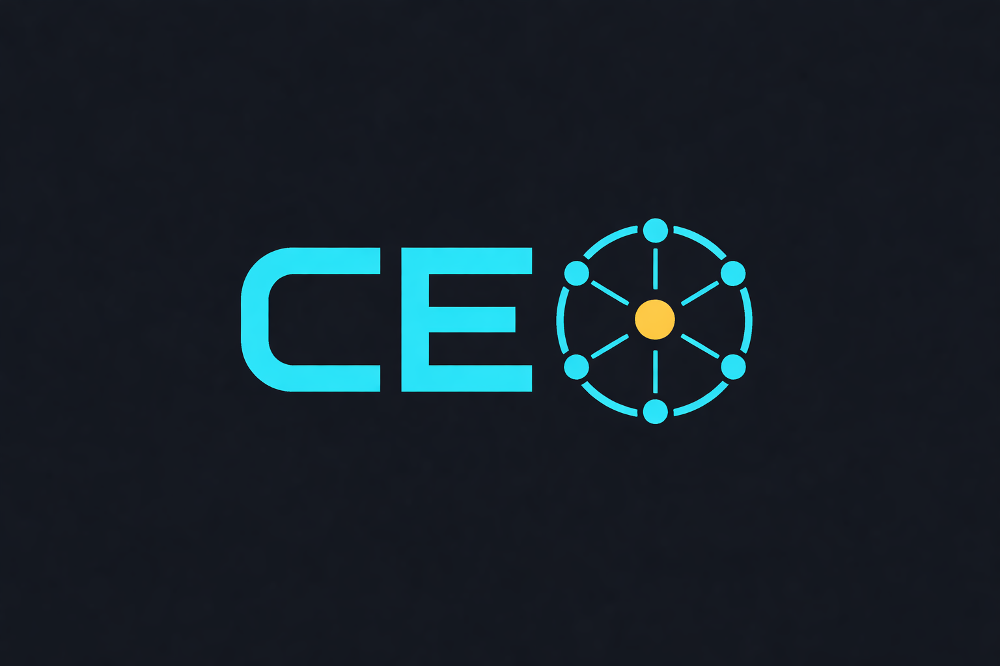
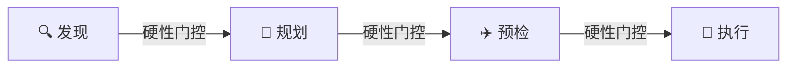

[English](README.md) | **简体中文**

<p align="center">
  
</p>

<h1 align="center">CEO - 首席执行协调器</h1>

<p align="center">
  <em>一个 Claude Code 插件，可协调 164+ 个专业 AI 智能体，覆盖 13 个领域。<br>结构化需求发现。依赖感知规划。硬性门控执行。</em>
</p>

<p align="center">
  
  
  
  
  
</p>

<p align="center">
  <a href="https://andywxy1.github.io/ceo-plugin/">🌐 访问官网</a>
</p>

---

## 🌐 官网

在 **[andywxy1.github.io/ceo-plugin](https://andywxy1.github.io/ceo-plugin/)** 探索完整的交互式文档、智能体目录和实时演示。

---

## 📦 包含内容

- **1 个技能** (`/ceo:ceo`) — 统筹全局的元编排器
- **164+ 个专业智能体**，覆盖 13 个领域（工程、设计、营销、销售、产品、项目管理、测试、支持、付费媒体、游戏开发、空间计算/XR、专项、战略）
- **19 份参考文档** — NEXUS 框架、阶段手册、场景运行手册、交接模板、反模式指南
- **会话启动钩子** — 检测到跨领域任务时自动建议使用 `/ceo`

---

## 🚀 安装

### 前置要求

- [Claude Code](https://claude.ai/download) v1.0.33 或更高版本
- 运行 `claude --version` 检查版本

### 第一步：添加市场源

在 Claude Code 中运行：

```
/plugin marketplace add andywxy1/ceo-plugin
```

### 第二步：安装插件

```
/plugin install ceo@ceo-plugin
```

### 第三步：重载并验证

```
/reload-plugins
```

运行 `/agents` 查看已加载的 164+ 个智能体，或运行 `/help` 确认 `ceo:ceo` 已列在可用技能中。

---

## 🔄 更新

更新到最新版本：

```
/plugin install ceo@ceo-plugin
```

然后重载：

```
/reload-plugins
```

---

## ⚡ 使用方法

调用 CEO 技能：

```
/ceo:ceo
```

CEO 遵循严格的**四阶段协议**，每个阶段转换都设有硬性门控：



1. **🔍 发现阶段** — 通过提问了解项目范围、涉及领域和约束条件
   - *硬性门控：用户必须确认项目简报后才能进入下一阶段*
2. **📐 规划阶段** — 将智能体匹配到需求，构建包含工作流和依赖关系的执行计划
   - *硬性门控：用户必须明确批准计划后才会启动任何智能体*
3. **✈️ 预检阶段** — 以只读模式启动关键智能体，在正式执行前发现歧义（所有项目规模均强制执行）
   - *硬性门控：所有歧义必须解决后才能开始执行*
4. **🚀 执行阶段** — 并行编排智能体，管理交接，通过检查点跟踪进度
   - *硬性门控：每个任务输出必须通过验收标准验证后才标记为完成*

---

<details>
<summary><h2>🛡️ 协议执行机制</h2></summary>

CEO 使用多层执行机制来防止常见的编排失败：

| 层级 | 机制 |
|------|------|
| **硬性门控** | 每个阶段转换处设置 `<HARD-GATE>` 屏障——不可绕过 |
| **验证协议** | 每个任务输出在标记完成前必须通过验收标准验证 |
| **清单转任务** | 质量门控标准转化为带证据要求的可追踪任务 |
| **合理化预防** | 12 条常见 CEO 捷径及其反驳的对照表 |
| **红旗警示** | 10 种触发立即重新评估的内部思考模式 |
| **反模式指南** | 10 种已记录的编排失败模式及修复方案 |
| **刚性/柔性分类** | 明确区分不可协商的协议和可调整的指南 |

### 刚性协议（绝不妥协）

阶段顺序、硬性门控、一级发现问题、质量门控清单、3 次重试上报限制、CEO 绝不亲自实现规则、交接模板格式、验证协议、计划审批门控、强制预检。

### 柔性协议（根据上下文调整）

每阶段智能体数量、冲刺周期、并行轨道、规模分类、场景运行手册选择、二/三级问题选择、检查点频率。

</details>

---

<details>
<summary><h2>🔗 NEXUS 流水线（冲刺/全规模）</h2></summary>

对于较大型项目，执行映射到 7 阶段 NEXUS 流水线：

```
阶段 0：情报与发现 (3-7天)          -> 门控：执行摘要生成器
阶段 1：战略与架构 (5-10天)         -> 门控：制片人 + 现实检查者
阶段 2：基础与脚手架 (3-5天)        -> 门控：DevOps + 证据收集者
阶段 3：构建与迭代 (2-12周)         -> 门控：智能体编排器
阶段 4：质量与加固 (3-7天)          -> 门控：现实检查者（唯一权限）
阶段 5：发布与增长 (2-4周)          -> 门控：制片人 + 分析报告者
阶段 6：运营与演进 (持续)           -> 治理：制片人
```

每个 NEXUS 阶段都有硬性门控、强制清单转任务机制和证据要求。

</details>

---

## 📋 场景运行手册

针对常见项目类型的预置激活模板：

| 场景 | 周期 | 详情 |
|------|------|------|
| **创业 MVP** | 4–6 周 | 18–22 个智能体，从发现到发布的压缩流程 |
| **企业级功能** | 8–12 周 | 完整的合规性和多团队协调 |
| **营销活动** | 2–4 周 | 多渠道内容生产 |
| **事件响应** | 1–5 天 | P0/P1 紧急响应 |

---

## 🤖 智能体领域

| 领域 | 数量 | 示例 |
|------|------|------|
| 🛠️ 工程 | 23 | 后端架构师、前端开发者、DevOps、安全工程师、SRE |
| 📣 营销 | 26 | SEO、TikTok、小红书、内容创作者、增长黑客 |
| 🎮 游戏开发 | 19 | Unity、Unreal、Godot、Roblox、叙事设计师、关卡设计师 |
| 💼 销售 | 9 | 交易策略师、管道分析师、销售教练、提案策略师 |
| 🎨 设计 | 8 | UX 架构师、UI 设计师、品牌守护者、视觉叙事者 |
| 🧪 测试 | 8 | API 测试员、性能基准测试员、无障碍审计员 |
| 📺 付费媒体 | 7 | PPC、程序化广告、付费社交、追踪专家 |
| 🔧 支持 | 6 | 分析报告者、财务追踪者、基础设施维护者 |
| 📊 项目管理 | 6 | 项目牧羊人、制片人、Jira 工作流管家 |
| 💡 产品 | 5 | 产品经理、冲刺优先级排序者、趋势研究员 |
| 🥽 空间计算/XR | 5 | visionOS、WebXR、Metal 工程师、XR 界面架构师 |
| ⚙️ 专项 | 29 | MCP 构建者、工作流架构师、文档生成器、ZK 管家 |
| 🧠 战略 | 1 | 智能体编排器 |

---

## 🧑‍💻 本地开发

无需安装即可本地测试：

```bash
claude --plugin-dir /path/to/ceo-plugin
```

修改后运行 `/reload-plugins` 即可生效，无需重启。

---

## 📄 许可证

MIT
